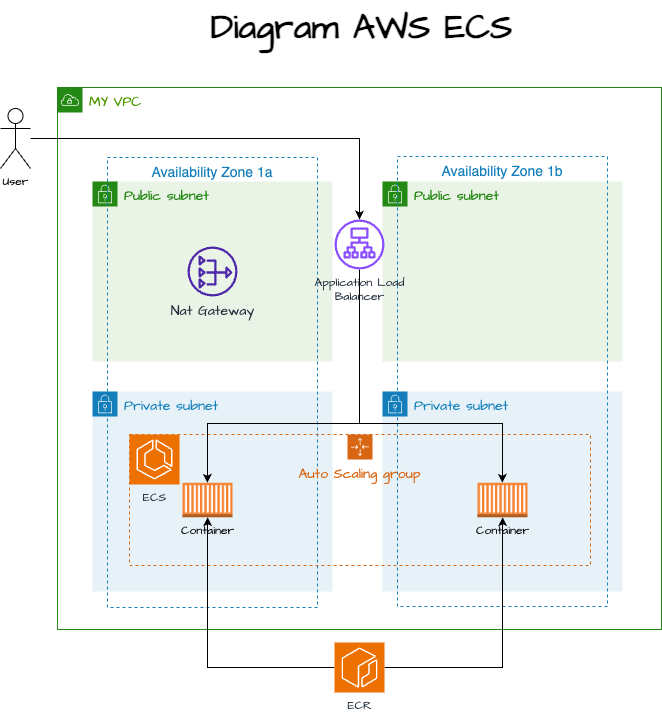
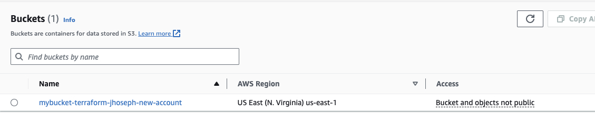

# Terraform

## ARCHITECTURE



## Pre-requisites

- Docker
- AWS ClI
- ACCESS KEY and SECRET KEY with profile
- Terraform

## Process

1. Create Bucket for State Terraform.

    

2. Add data.
    - terraform.tfvars
        - task_definition_image_repo = "< your-id-account >" and "< region >"
    - package.sh
        - id_account="< your-aws-id-account >"
        - region="< region >"
        - profile="< your-profile >"
    - If you want to change the port from 5000 to another value...
        - Dockerfile = 5000
        - app.py = 5000
        - Modules/SecurityGroup
            - Inbound 5000
        - Modules/ALB
            - health_check_port 5000
        - Module/Task
            - terraform.tfvars
                - task_definition_container_port = 5000
        - Module/ECS/Service
            - main.tf
                - container_port

3. Run

    ```bash
    cd Terraform
    chmod +xw package.sh
    ./package.sh
    ```
